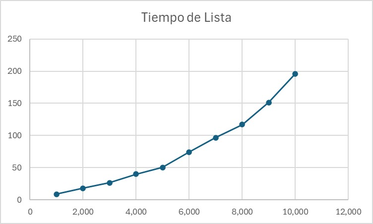
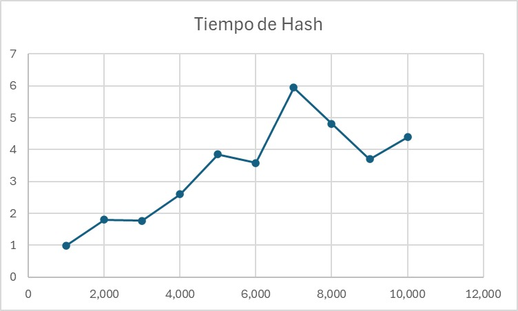
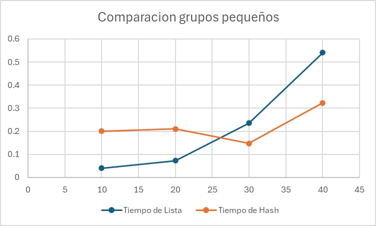
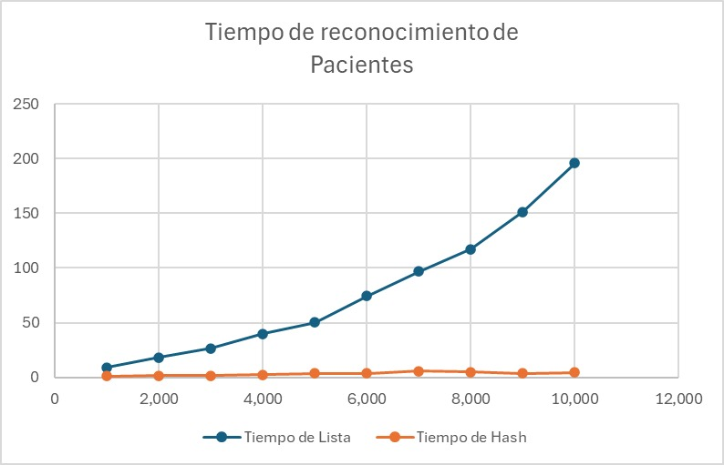

# Proyecto Detección de Registros Idénticos (Tablas de Hash)
---
**Equipo:**  
- Luis Fernando Reyes Altamirano  
- Ricardo André Gorostieta Jurado  
- Irene Escudero Cazarez  

Tiempo de trabajo individual: 5–7 horas cada uno  
Tiempo de trabajo total: 15–21 horas

Proyecto de la materia **Estructura de Datos Avanzadas**, que detecta si existen pacientes con **registros de laboratorio idénticos** (tuplas de 10 enteros) y **compara el desempeño** de dos enfoques de almacenamiento/búsqueda:

- **Arreglo lineal (búsqueda secuencial)**
- **Tabla de hash** (encadenamiento o direccionamiento abierto)

El objetivo es leer un archivo con **n** pacientes (1 ≤ n ≤ 100,000), donde cada línea posterior a la primera contiene **exactamente 10 enteros** (0 a 10,000,000) separados por espacio o tabulador, y producir una salida que indique si **no hay** pacientes con registros idénticos o si **se encontraron m pacientes idénticos**.

---

## Estructura del proyecto
```plaintext
├── src/
│   ├── LeerPacientes.java      # Lector robusto del archivo (lee n y luego n líneas con 10 enteros)
│   ├── Patient.java            # Tupla inmutable de 10 enteros (equals/hashCode)
│   ├── LinearSolution.java     # Detección con arreglo lineal (O(n²) peor/promedio)
│   ├── HashSolution.java       # Detección con tabla de hash (O(n) promedio)
│   ├── MainCheck.java          # Programa principal que imprime la salida requerida
│   └── Benchmark.java          # Comparador de tiempos y generación de CSV
├── data/
│   └── ejemplo.txt             # Archivo de ejemplo con formato válido
├── README.md                   # Este documento
└── Makefile                    # (Opcional) Atajos para compilar/ejecutar
```
---
##  Cómo ejecutar

 1. **Compilar todos los archivos**

 2. **Ejecutar el programa principal:**
java TriageSystem

---

## Gráficas e interpretaciones

En las siguientes gráficas comparamos el desempeño de las dos estructuras de datos (La lista como manera de ordenamiento lineal y la tabla hash) Se realizaron usando la clase compare structure variando N, que es el total de pacientes, en grupos de 1,000 en 1,000. Tambien se forzo en esto a que hubiera 4 elemntos repetidos.

 
La lista mostro un desempeño exponencial en cuanto a tiempo, cada vez que se le agregan datos su tiempo de recorrido va aumentando ya que cada vez hay mas datos que recorder. Pero por otro lado contextos con bajos volumenes de datos son muy eficientes ya recorren rapido todos los datos.


 
La tabla hash tiene un muy buen desempeño con grandes volumenes de datos, ya que su aumento es constante. Con pocos volumenes de datos sigue siendo eficiente, aunque hay mejores alternativas, como se puede ver en la grafica siguiente.
  

 

En desempeño en la función Insert podemos observar como al principio las dos estructuras van parejas en base al tiempo, pero después en la lista se va acumulando mucho el tiempo de insertar a comparación del árbol. El cual conviene más si la cantidad de datos es más grande, esto es por que la lista ligada tiene que recorrer toda la lista al insertar un nuevo elemento y aumenta el tiempo de recorrido entre mas larga sea la lista.

##  Conclusion final

En conclusion a lista ordenada permite eliminar al paciente con mayor prioridad con mayor facilidad, pero sufre al insertar nuevos pacientes, ya que debe recorrer la lista para mantener el orden, resultando en un mayor tiempo de ejecucion. Por otro lado, el BST equilibra mejor las operaciones: tanto la inserción como la búsqueda y eliminación se realizan rapidamente. La comparación experimental entre ambas estructuras evidencia que la lista es más eficiente en escenarios con pocas inserciones y muchas eliminaciones, mientras que el árbol resulta más escalable y robusto cuando el volumen de pacientes aumenta. Esto demuestra la importancia de seleccionar la estructura de datos adecuada según las características del problema real.  


