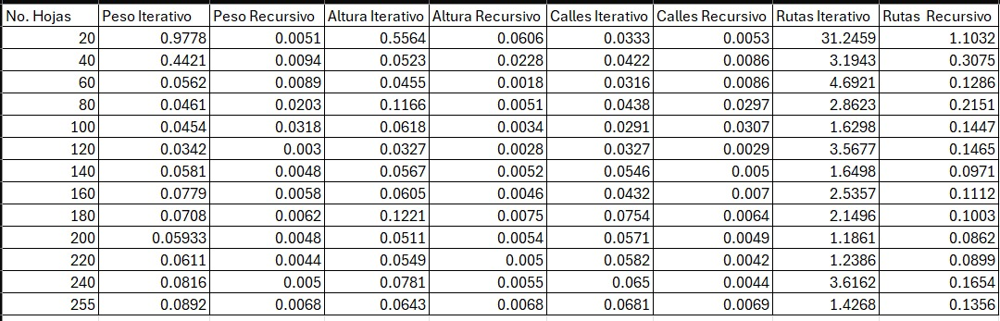
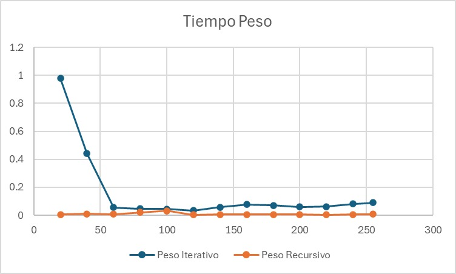
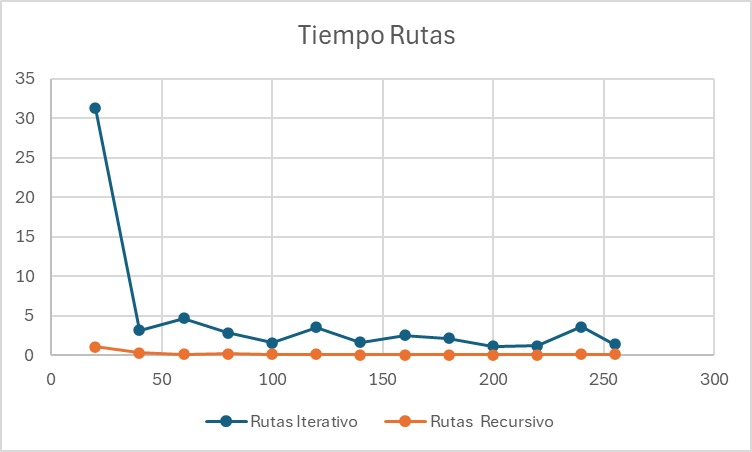
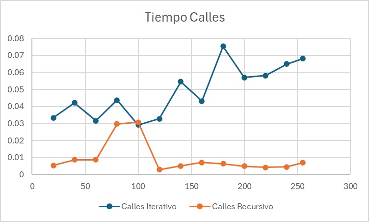
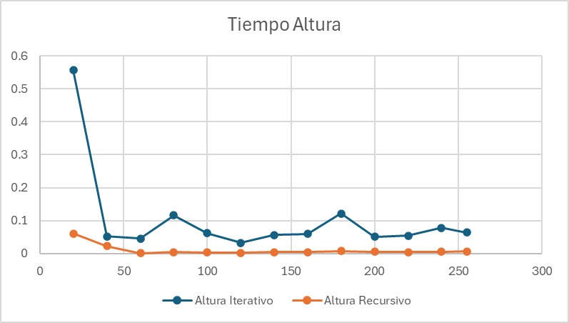

# Proyecto: Recursión para la Recolección de Paquetes

**Equipo:**  
- Luis Fernando Reyes Altamirano  
- Ricardo André Gorostieta Jurado  
- Irene Escudero Cazarez  

Tiempo de trabajo individual: 6–7 horas cada uno  
Tiempo de trabajo total: 18–21 horas

Este proyecto es parte de la práctica de **Recursión** de la materia **Estructura de Datos**. El objetivo principal es desarrollar un programa que permita al agente postal de **Correos de México** planificar las rutas para la recolección de paquetes en diferentes oficinas, basándose en un mapa con la distribución de las oficinas y el peso de los paquetes.

El proyecto consiste en implementar dos versiones del programa:

- **Versión Iterativa:** Utilizando una pila para almacenar y gestionar el recorrido.
- **Versión Recursiva:** Utilizando recursión para gestionar el recorrido de manera más directa.

## Objetivos

- **Aplicar recursión** en un problema práctico.
- **Comparar el desempeño** de algoritmos alternativos para la misma solución: una versión iterativa y una recursiva.

## Descripción del Problema

El centro de distribución de Correos de México tiene que organizar la recolección de paquetes en varias oficinas durante diferentes días de la semana. Cada oficina tiene un peso asignado de paquetes a recolectar. Los datos están representados en un mapa estructurado como un árbol donde:

- La raíz del árbol es el centro de distribución.
- Las hojas del árbol son las oficinas de correos.
- Los nodos intermedios representan las rutas a seguir entre oficinas.

El programa debe ser capaz de determinar las rutas óptimas y el peso total que el agente recogerá cada día.

## Entrada

Un archivo de texto que contiene el mapa de rutas de recolección para cada día de la semana. Cada línea del archivo representa un día de la semana, y cada línea tiene un árbol de rutas donde las hojas contienen los pesos de los paquetes a recolectar.

## Salida

Una línea por cada día de la semana que indique:
- Ruta seguida.
- Número de calles visitadas.
- Peso total recolectado.

## Estructura del Proyecto

### PR2/

```
├── arboles.txt                   # Archivo de entrada con los mapas de rutas (versión de prueba).
├── CompareEstructuras.java       # Clase para obtener datos y comparar el rendimiento de las versiones.
├── Nodo.java                     # Clase genérica para la estructura de la pila.
├── NodoArbol.java                # Clase que modela un nodo de un árbol (oficina o cruce de ruta).
├── PilaArbol.java                # Clase que implementa la estructura de datos de pila.
├── ProcesadorArbol.java          # Contiene la lógica principal de los algoritmos iterativos y recursivos.
├── Prueba.java                   # Programa principal que ejecuta ambas versiones y muestra los resultados.
├── TestComparacion.java          # Clase para realizar pruebas de rendimiento.
├── README.md                     # Documentación del proyecto.
```
## Como ejecutar

1. Compilar todos los archivos

2. Ejecutar el programa principal:
   En `TestComparacion`, cambiando el "arboles.txt" por el archivo deseado

---

## Gráficas e interpretaciones


  

  
La tabla hash tiene un muy buen desempeño con grandes volúmenes de datos. Sin embargo, con volúmenes pequeños de datos, sigue siendo eficiente, aunque existen mejores alternativas, como se puede ver en la gráfica siguiente.

  

Como es notorio, a partir de más de 20 datos, el hash se vuelve más eficiente que la lista. A continuación, se contraponen el Hash y la Lista en grupos de 1,000 en 1,000.

  
  
Este gráfico muestra el tiempo que tardó el programa en encontrar la altura de la profundidad de las ramas del árbol que fue un cálculo clave que usamos para todos los demás métodos. Como se puede ver, el método recursivo lo hizo de manera muy rápida y parejo, sin altibajos. En cambio, el método iterativo tardó mucho más al principio y fue inconsistente, como en las gráficas y métodos anteriores.

## Conclusión final
Este proyecto demuestra que la elección del algoritmo correcto es crucial para resolverde la manera más eficiente un problema. Aunque tanto la recursión como la iteración pueden resolverlo, los resultados de nuestras pruebas muestran diferencias significativas. Para problemas de árboles, la recursión se comportó de manera más eficiente y consistente, ya que su estructura para dividir un problema grande en subproblemas idénticos se alinea perfectamente con la naturaleza del árbol.

Por otro lado, la versión iterativa, al requerir de una pila, introdujo un costo adicional que la hizo más lenta y menos predecible. Esto nos enseña que un análisis cuidadoso del problema y de la estructura de datos es fundamental para elegir la solución más práctica. En el mundo real, comprender estas diferencias es lo que nos permite escribir código que no solo funciona, sino que lo hace de la manera más óptima posible.

