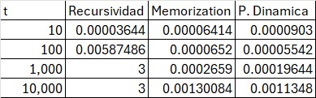
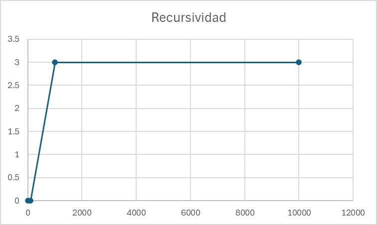
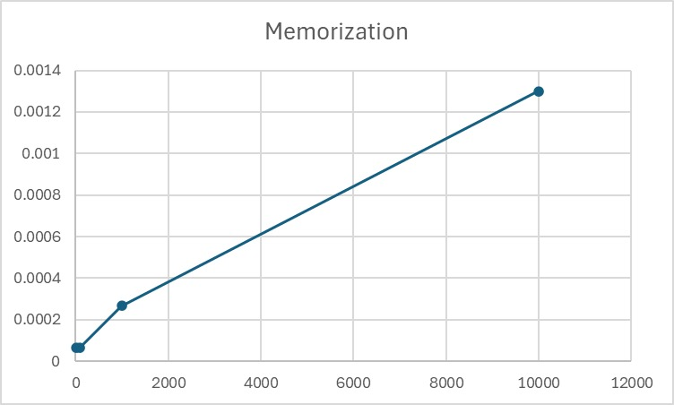
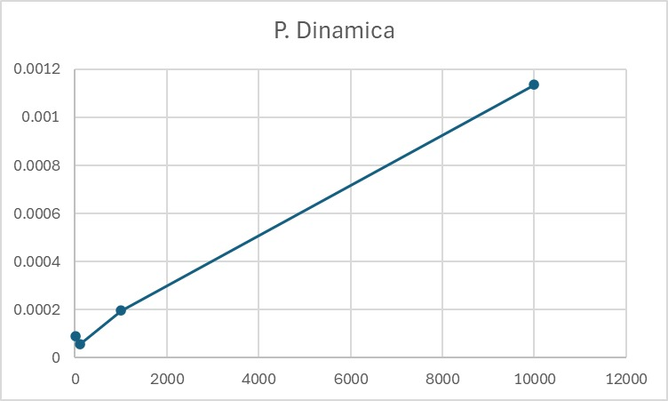

# Proyecto: Homero y las Hamburguesas — Programación Dinámica

**Equipo:**

* Luis Fernando Reyes Altamirano
* Ricardo André Gorostieta Jurado
* Irene Escudero Cazarez

**Tiempo de trabajo individual:** 2-3 horas cada uno
**Tiempo de trabajo total:** 6-9 horas

Este proyecto es parte de la práctica de **Memoización y Programación Dinámica** de la materia **Estructura de Datos**. El objetivo principal es desarrollar un programa que permita determinar cuántas hamburguesas Homero Simpson puede comer en un tiempo limitado, aplicando diferentes enfoques algorítmicos para encontrar la solución óptima.

El proyecto consiste en implementar tres versiones del programa:

* **Versión Recursiva:** Solución básica y directa mediante backtracking.
* **Versión con Memoización:** Recursión optimizada almacenando resultados intermedios.
* **Versión con Programación Dinámica:** Construcción iterativa de la solución óptima.

---

## Objetivos

* Aplicar **recursión**, **memoización** y **programación dinámica** en un mismo problema práctico.
* **Comparar el desempeño** de los tres enfoques.
* Identificar ventajas y desventajas de cada técnica.
* Relacionar el análisis teórico con los resultados empíricos.

---

## Descripción del Problema

Durante la hora de comida, Homero Simpson come hamburguesas y toma bebidas gaseosas durante `t` minutos. Hay dos tipos de hamburguesas: una tarda `m` minutos en comerse y la otra `n` minutos. Homero **solo puede comer hamburguesas enteras** y busca **maximizar el número de hamburguesas** que puede comer en el tiempo disponible.

Si no utiliza todo el tiempo comiendo hamburguesas, **el sobrante lo dedica a tomar bebidas gaseosas**.

El programa debe determinar la mejor combinación de hamburguesas de tipo `m` y `n` para alcanzar el número máximo posible. Si hay varias combinaciones que maximizan la cantidad, se elige aquella con el **menor sobrante de tiempo**.

---

## Entrada

Un archivo de texto que contiene los valores `m`, `n` y `t` (en minutos). Cada línea representa un problema a resolver.

* `m`: minutos que tarda en comerse una hamburguesa del primer tipo.
* `n`: minutos que tarda en comerse una hamburguesa del segundo tipo.
* `t`: tiempo total disponible.

Valores en el rango `[0, 10000]`.

---

## Salida

Por cada caso:

* Si Homero puede usar exactamente `t` minutos comiendo hamburguesas:
  → imprimir: `#hamburguesas m n`

* Si no puede usar todo el tiempo:
  → imprimir: `#hamburguesas m n sobrante`

* Si el tiempo de ejecución excede 3 segundos:
  → imprimir: `tiempo límite excedido`

---

## Estructura del Proyecto

```
├── casos.txt                    # Archivo de entrada con los casos de prueba.
├── HomeroRecursivo.java         # Versión recursiva sin memoización.
├── HomeroMemo.java              # Versión con memoización.
├── HomeroDP.java                # Versión bottom-up.
├── CompareEstructuras.java      # Clase para obtener datos y comparar rendimiento.
├── TestComparacion.java         # Clase para realizar pruebas de rendimiento.
├── README.md                    # Documentación del proyecto.
```

---

## Cómo ejecutar

1. Compilar todos los archivos.
2. Ejecutar `TestComparacion`, cambiando el archivo `casos.txt` según el conjunto de pruebas deseado.

---

## Casos de Prueba

Se realizaron pruebas con diferentes valores de `t` y combinaciones de `m` y `n` para comparar el rendimiento:

```
m = 4, n = 9, t = 10
m = 4, n = 9, t = 100
m = 4, n = 9, t = 1000
m = 4, n = 9, t = 10000
```

---

## Gráficas e Interpretaciones

### Tabla de resultados de las pruebas:

  

---

### Gráficas realizadas

  
La gráfica muestra que el algoritmo **recursiva** es eficiente y estable con baja cantidad de tiempo, pero conforme aumenta el tamaño del problema ya no es la mejor opcion. Mientras más aumenta t más se tarda en resolver el problema, hasta que llega al limite que nosotros impusimos para que no se tarde tanto. Los costos algoritmicos van creciendo exponencialmente.

---

  
La gráfica refleja como la memoización es un metodo optimizado de la recursividad, el crecimiento del costo algoritmico es lineal, por lo tanto no sube tanto. El tiempo t crece linealmente, es bueba solución pero todavia se puede optimizar.

---

  
Esta es la grafica de programación dinamica muestra como esta es más optima que la memoización. Esta tiene costos lineales, pero con una constante más baja. Por esa razón los costos son menores que ne memoización. 

---

  
Aqui podemos observar como la versión que más costo tiene es la de Recursividad, ya que desarrolla un arbol que en cantidades de tiempo grandes se vuelve muy impractico. En la de Memoización y programación dinamica se ve como sus costos no suben mucho, ya que son las optimas.Siendo la más optima la de programción dinamica.

---

## Conclusión Final

Este proyecto demuestra la importancia de elegir el enfoque algorítmico adecuado. Aunque las tres versiones llegan al mismo resultado óptimo:

* **Recursiva:** Muy lenta en tamaños grandes, útil solo para explicar la lógica básica.
* **Memoización:** Buena eficiencia y fácil de implementar, con costo adicional en memoria.
* **Programación Dinámica:** La solución más rápida y estable para `t` grandes.


---