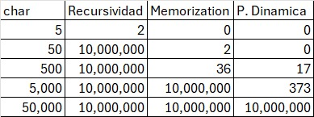
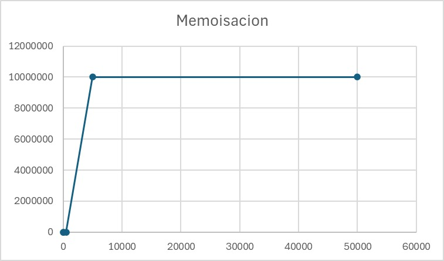
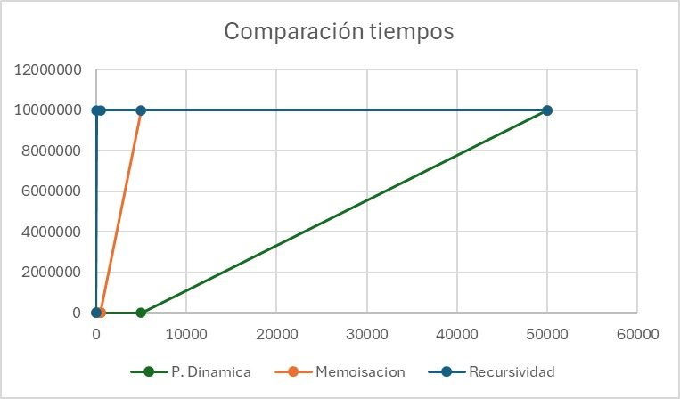

# Proyecto: Distancia de Levenshtein — Recursión y Programación Dinámica

**Equipo:**

* Luis Fernando Reyes Altamirano
* Ricardo André Gorostieta Jurado
* Irene Escudero Cazarez

**Tiempo de trabajo individual:** 2-3 horas cada uno
**Tiempo de trabajo total:** 6-8 horas

Este proyecto es parte de la práctica de **Recursividad, Memoización y Programación Dinámica** de la materia **Estructura de Datos**. El objetivo principal es desarrollar un programa que permita determinar la distancia de edicion entre el texto que se extraega de dos archivos. delta = 1 y alfa = 2. Delta es el costo de inserción o borrado. Alfa es el costo de cambiar caracteres.

El proyecto consiste en implementar tres versiones del programa:

* **Versión Recursiva sin Memoización:** 
* **Versión Recursiva sin Memoización:** 
* **Versión con Programación Dinámica:** 

---

## Objetivos

* Aplicar **recursión sin memoización**, **recursión con memoización** y **programación dinámica** en un mismo problema práctico.
* **Comparar el desempeño** de los tres enfoque para ver cual conviene más.
* Identificar ventajas y desventajas de cada técnica.
* Relacionar el análisis teórico con los resultados y analizarlos en base a gráficas.

---

## Descripción del Problema

El problema que resolvemos en esta práctica es ayudar a un profesor de bachillerato que sospecha que sus estudiantes están entregando tareas muy parecidas.

Nuestro objetivo es **cuantificar numéricamente qué tan similares son** dos documentos de texto. El principal reto es el **desempeño**, ya que cada ensayo puede tener hasta 50,000 caracteres (entre 5,000 y 10,000 palabras). Necesitamos un algoritmo que pueda comparar archivos de ese tamaño sin tardar demasiado.

Para hacerlo, implementamos un programa que calcula la **distancia de edición** (Levenshtein) entre dos textos. Esta distancia mide el "costo" mínimo para convertir un texto en otro usando tres operaciones básicas, con costos definidos:

* **Insertar** un carácter: $\beta$
* **Borrar** (eliminar) un carácter: $\beta$
* **Reemplazar** un carácter por otro: $\alpha$

Para esta práctica, los valores específicos que usamos fueron **$\alpha = 2$** y **$\beta = 1$**.

## Entrada

El programa recibe como entrada los **nombres de dos archivos de texto**, `A` y `B`, que son los documentos que se van a comparar.

* **Formato:** Los archivos deben ser de texto plano (`.txt`) codificados en **UTF-8**.
* **Longitud Máxima:** Cada archivo puede tener una longitud máxima de **50,000 caracteres**.

## Salida

Lo que debe imprimir el programa es una **sola línea de texto** con toda esta información:

* El número de caracteres del documento `A` y del `B`.
* La distancia de edición que calculó: `D(A, B)` y `D(B, A)`.
* El tiempo que se tardó en hacer el cálculo de las distancias.

**Especificación del tiempo:** Si el cálculo se tarda **más de 10 segundos**, el programa va a detenerse y mostrar el mensaje: `tiempo límite para resolver el problema excedido`.

## Estructura del Proyecto

Así es como organizamos los archivos:

├── CalculaDistancia.java    # Clase que calcula las distancias (versión recursiva y con memoización).
├── dinamico.java            # Aquí está la implementación de la versión iterativa (Programación Dinámica).
├── Graficas.java            # Clase para generar los datos de tiempo de ejecución para los tres métodos.
├── Prueba.java              # Clase de prueba que usamos para verificar los diferentes métodos.
├── texto1.txt               # Archivo de ejemplo para las pruebas.
├── texto2.txt               # El segundo archivo para comparar.
└── README.md                # La documentación del proyecto (este archivo).

## Cómo ejecutar

1. Compilar todos los archivos.
2. Ejecutar `Prueba`, metiendo en la terminal los nombres de los dos archivos de texto que quieres comparar.

## Casos de Prueba

Para poner a prueba cada versión y ver cómo se comportaba su rendimiento, corrimos los algoritmos con documentos de diferentes tamaños.

Usamos textos con las siguientes longitudes de caracteres para nuestras pruebas:

* **5** caracteres
* **50** caracteres
* **500** caracteres
* **5,000** caracteres
* **50,000** caracteres

El objetivo era medir el tiempo de ejecución en cada caso para después poder graficar y comparar el desempeño de los tres métodos.

## Gráficas e Interpretaciones

  

  

  

  

## Conclusión Final

El objetivo de esta práctica era probar tres métodos diferentes para ver cuál era el más eficiente para resolver el problema. Y la verdad, la diferencia de rendimiento fue enorme.

* **Versión Recursiva sin Memoización:** Esta fue nuestro primer codigo, pero enseguida vimos que no era práctica. Su rendimiento es muy bajo y se pasaba del límite de 10 segundos con textos muy cortos. Para este problema **no es una opción viable**.

* **Versión Recursiva con Memoización:** Aquí vimos una gran mejora. Simplemente al guardar los resultados que ya habíamos calculado, el rendimiento se crecio bastante y esta versión **fue capaz** de manejar los archivos medianos, pero con los grandes ya no pudo. Demostró ser una solución buena, aunque las llamadas recursivas todavía le pesa cuando ya son muchos datos.

* **Versión con Programación Dinámica:** Esta fue la **mejor opción**. Al construir la solución de abajo hasta arriba, es mucho más directa y se quita de encima todo el trabajo extra de la recursión. Fue la **más rápida y eficiente**, y la única que de verdad aguantó los 50,000 caracteres sin pasarse del limite de tiempo.

La mejor opcion es la de porgramacion dinamica, ya que se salta los pasos de la recursión y evita resolver problemas que ya resolvio anteriormente. La versión momoizable sirve para archivos con pequeño texto y la recursiva sin momoización es muy ineficiente.